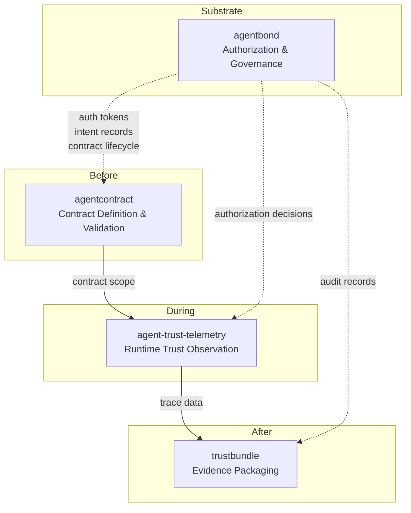

# Agent Trust Suite

> Trust infrastructure for multi-agent systems.
> Define contracts. Observe behavior. Verify traces.

As multi-agent systems grow through protocols like [A2A](https://github.com/google/A2A) and [MCP](https://modelcontextprotocol.io/), interoperability is advancing rapidly — but the trust layer remains thin. Agents can talk to each other, but there is no standard way to verify that they behave as expected.

**Agent Trust Suite** is an open-source collection of tools that makes agent behavior **observable and verifiable** across the execution lifecycle.

## What This Suite Helps You Verify

- That agents act within pre-agreed contracts
- That deviations are detected in real time during execution
- That verifiable evidence trails remain after execution

## 3 Layers

```
┌─────────────────────────────────────────────────────────┐
│  Before Execution                                       │
│  agentcontract — Define expected behavior as contracts  │
├─────────────────────────────────────────────────────────┤
│  During Execution                                       │
│  agent-trust-telemetry — Observe trust risks in real    │
│  time                                                   │
├─────────────────────────────────────────────────────────┤
│  After Execution                                        │
│  trustbundle — Preserve tamper-evident evidence trails   │
└─────────────────────────────────────────────────────────┘
        ▲
        │  Authorization Substrate
        │
  agentbond — Shared governance infrastructure
  powering authorization, intent tracking, and contracts
  across all three layers (MCP Server / SDK)
```

## Quick Start

### Try the Demo

See the full trust lifecycle in 60 seconds — no API keys required:

```bash
npx agent-trust-cli demo
```

Or use individual commands:

```bash
npx agent-trust-cli verify bundle.json       # Verify a trust bundle
npx agent-trust-cli inspect contract.yaml    # Inspect any trust artifact
```

> For live telemetry evaluation in the demo, also install: `pip install agent-trust-telemetry`

### Individual Tools

Each tool can be used independently. Pick the layer relevant to your use case:

**agentcontract** (Node.js) — Define and validate agent behavior contracts

```bash
npm install -g agentcontract
agentcontract init --name my-agent
agentcontract run my-agent.contract.yaml
```

**agent-trust-telemetry** (Python) — Detect instruction contamination across agent traces

```bash
pip install agent-trust-telemetry          # if published
# or install from source:
git clone https://github.com/wharfe/agent-trust-telemetry.git
cd agent-trust-telemetry && pip install -e ".[dev]"

att evaluate --message message.json
att evaluate --stream trace.jsonl
```

**trustbundle** (Node.js) — Package execution traces into tamper-evident bundles

```bash
npm install -g trustbundle               # if published
# or install from source:
git clone https://github.com/wharfe/trustbundle.git
cd trustbundle && npm install && npm run build

trustbundle init
trustbundle build <trace.jsonl>
trustbundle verify <bundle.json>
```

**agentbond** (Node.js monorepo) — Governance infrastructure with MCP Server

```bash
npx @agentbond/mcp-server                # run MCP server directly
# or use as a library:
npm install @agentbond/auth @agentbond/intent @agentbond/contract @agentbond/settlement
```

### Unified CLI

[agent-trust-cli](https://github.com/wharfe/agent-trust-cli) provides a single entry point with `demo`, `verify`, and `inspect` commands. CLI name may change in future releases.

## Architecture

See [docs/architecture.md](docs/architecture.md) for the detailed data flow between components.



## Status

| Repository | Version | Stage | Language |
|---|---|---|---|
| [agentcontract](https://github.com/wharfe/agentcontract) | 0.1.0 | MVP — API may change | Node.js |
| [agent-trust-telemetry](https://github.com/wharfe/agent-trust-telemetry) | 0.1.0 | Alpha — MVP phase complete | Python |
| [trustbundle](https://github.com/wharfe/trustbundle) | 0.1.0 | MVP — digest-based integrity | Node.js |
| [agentbond](https://github.com/wharfe/agentbond) | 0.1.0 | MVP — 17 MCP tools available | Node.js |

> All components are in early development. APIs and interfaces may change.

## Contributing

Contributions are welcome! Each repository accepts issues and pull requests independently.

For suite-level discussions (cross-repo architecture, new layer proposals, demo scenarios), please use this repository's [Issues](https://github.com/wharfe/agent-trust-suite/issues).

## License

[MIT](LICENSE)
